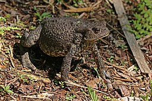

```{r setup, include=FALSE}
library(learnr)
knitr::opts_chunk$set(echo = FALSE)
library(here)
library(kableExtra)

load(here::here("./inst/tutorials/toad_spreadsheet/toad_as_character.RData"))

# footnotes to appear at bottom of main windw
footnotes <- c(
"Notes: notes on each row", 
"n: sample size; the total number of toads, coin flips etc",
"X.R.hand: Right-handed; the number of right-handers observed in a sample.  This study observed 14 righties.",
"prop.x: proportion X; the number of right-handed toads (X) out of all of them (n)",
"prob.x: probability X: is the probability that, if our null is correct, how likely are we to end up with a sample of 14 right handers out of 18 due to chance.")

# bootstrap options for tables (?)
my.boot.opt <- c("striped", 
                 "hover", 
                 #"condensed",
                 "responsive")
```

## To Do

* worksheet as pdf
* plots (barplots)?

## Preface

This tutorial is based on Chapter 6, "Hypothesis testing"" from Whitlock & Schluter's [*Analysis of Biological Data*.](http://whitlockschluter.zoology.ubc.ca/).

In section 6.2: "Hypothesis testing: an example" (pg 153, 2nd ed), Whitlock & Schluter present data from a paper by Bisazza et al (1996) titled ["Right-pawedness in toads"](https://www.nature.com/articles/379408a0), published in Nature.

Whitlock and Schluter's main goal is introduce the general workflow of hypothesis testing.  This tutorial will go a bit deeper into some of the math behind what they are doing.



#### References

Bisazza, A, C Cantalupo, A Robins, LJ Rogers and G Vallortigara.  1996.  [Right-pawedness in toads.  Nature 379: 408.](https://www.nature.com/articles/379408a0)

Fitch & Braccini 2013.  [Primate laterality and the biology and evolution of human
handedness: a review and synthesis.  Annal of the New York Academy of Sciences.](https://nyaspubs.onlinelibrary.wiley.com/doi/abs/10.1111/nyas.12071)

Whitlock, M and D. Schulter.  2014.  Analysis of Biological Data.  Freeman. [Book website.](http://whitlockschluter.zoology.ubc.ca/) Available on [Amazon](https://www.amazon.com/Analysis-Biological-Data-Michael-Whitlock/dp/1936221489/ref=sr_1_1?ie=UTF8&qid=1533844028&sr=8-1&keywords=analysis+of+biological+data)


## Introduction: handedness in Humans

Most humans preferentially carry out tasks with a single hand.  The data used in this tutorial and the section in Whitlock and Schulter (2014) its based come from a study that ask: Do other species preferentially complete tasks with one hand (or paw)? 

```{r human.hands}
question("Most humans are right handed.  What proportion of the population do you think is right handed?",
    answer("0.5"),
    answer("0.75"),
    answer("0.90", 
     correct = TRUE,
     message = "Typically the proportion of a population which is right handed is 0.90 (= 90%)"),
    answer("0.99"),
    allow_retry = TRUE
  )
```


## Introduction: handedness in toads?

Humans populations are typically about 90% right-handed (Fitch & Braccini 2013).   As part of larger study, Bisazza et al (1996) assayed 18 wild-caught [common toads (*Bufo bufo*)](https://en.wikipedia.org/wiki/Common_toad) in the lab to determine whether they completed a task preferentially with their right or left paws.

In this particular study, 14 of the 18 toads completed the task with their right paw, and 4 completed it with their left.  Is this evidence that toads in this population are like humans and predominantly use one paw over the other? 


```{r assumption}
question("Pop quiz: what is a relevant assumption we will have to make about these toads brought in to the lab in order for out statistical calculations to be correct?",
    answer("They are indeed toads and not frogs."),
    answer("They were randomly sampled from the population", 
           correct = TRUE,
           message = "This is a ubiquitous statistical assumption.  But how would it actually be achieved when sampling toads? ..."),
    answer("Toads care about math"),
    answer("42"),
    allow_retry = TRUE
  )
```

(Sorry, am working on this one)

## Overview of tutorial

In this tutorial we will walk through Whitlock & Schluter's assessment of the question of toad handedness and carry out a formal **hypothesis test** to address this question.  We will work through the calculations needed to reproduce Table 6.2-1 (page 156) and the other calculations in the text (pages 153-159), as well as dig a bit deeper into the underlying math.  We can do all of these calculations in Excel or another spreadsheet.

In particular, we will walk through the process of carrying out a **hypothesis test** using what statisticians call **binomial data**.  We will do this by calculating a **p-value** and comparing it against a something known as a **sampling distribution.**  Sampling distributions are a very challenging concept in statistics, and sometimes they are skipped altogether.  Working with binomial data, however, makes it a bit easier to see how they work.  In their book, Whitlock & SHulter only touch upon sampling distributions with their toad example, and diving into the topic further in chapter xx.


## Caveat: the hypothesis we are focused on

It should be noted that the specific hypothesis being tested is not whether frogs are predominantely right-handed or left-handed; rather, whether there is an overall tedency in the population to favor one hand, which could be right handed or left handed.  

Stated another way, we are focused on the question "Are toads **un**-biased" in their paw preference?"  The **null hypothesis (Ho)** is therefore "there is no bias in handedness."

If they *are* biased, they could be either biased to being right-pawed OR biased towards being left-pawed.  The right or left question is dealt later though.  The **alternative hypothesis (Ha)** therefore encompasses both options.  This is somewhat awkward, but the reason things are framed this way should gradually become apparent. 

One way thinking about this is to imagine I hadn't told you about the data from the experiment yet but had just ask you "do you think frogess are 'handed' like humans?" and not gotten into the specifics for right or left handed yet.

## Hypothesis testing with binomial data

Before getting into the specific calculations let's topic about the *type* of data we are working with.  We'll step away from amphibians for a second and think about something for familiar: **coin flipping.**

When you [flip a coin](https://en.wikipedia.org/wiki/Coin_flipping) you get one of two possible results: 

* "heads" (usually the face of a famous person), or 
* "tails" (An animal?  A monument?)  

Statisticians call the process of flipping the coin a **trial**.  In particular they usually call it a **binomial trial** or a [**Bernouli trial**](https://en.wikipedia.org/wiki/Bernoulli_trial), named after the 15th century mathematician [**Jacob Bernoul**](https://en.wikipedia.org/wiki/Jacob_Bernoulli).   

If you do several coin flips you have generate data which can give you information on how likely you are to get heads or tails.  This is called **binomial data**.  The number of heads you get is the number of **events** or **successes**.


## The toad data are binomial data

The toad data from Bisazza et al (1996) is also **binomial data**.  It consists of 18 **trials** where there are two possible results: left paw or right paw.

**Binomial data** is very common in biology: 

* Survival: Is an organism alive or dead?  
* Reproduction: Is a fruit fly "virgin" or not?
* Species interactions: Was a flower eaten or not eaten?  
* Disease: Is a patient infected with a virus or not?  

Binomial data is also very useful for demonstrating core concepts of hypothesis testing because the math is fairly easy.


```{r binom.dat}
question("Which one of the following do you think is a type of **binomial data** that could be collected on fruit flies?",
    answer("The length of fruit fly wings",
    message = "This would be a type of continous numeric data"),
    answer("The color of fruit fly eyes", 
           message = "Fruit fly eyes can be many different colors, not just two"),
    answer("Fruit sex (male or female)", 
           correct = TRUE,
           message = "When there are two possibilities the data can be binomial"),
    answer("The number of eggs laid by a female fruit fly",
           message = "Fruit flies can lay many eggs; this would be a type of count data."),
    allow_retry = TRUE
  )
```


## Carrying out calcualtions in a spreadsheet 

The goal of this tutorial is to walk you step by step through the calculations done by Whitlock & Schluter and to provide opportunities to interact directly with the data.  Ideally, while working through this tutorial you will carry out the calculatiosn as you go either on the provided worksheet or in a spreadsheet.  A spreadsheet-like table will be displayed showing you the calculations as they are done.  (You can also do calculations using basic R code within the tutorial if you want.)

There will also be prompts to answer questions on the calculatiosn and concepts as you go.  


## Learning objectives

By the end this tutorial you should be familiar with these cocnepts and any related calculations

* Hypothesis 
* Null hypothesis (Ho)
* Alternative hypothesis (Ha)
* Sampling distribution
* test statistic
* binomial data
* critical value (alpha)
* binomial distribution


## Summary of the toad-handedness data

The table below summarizes the data we will be using and the abbreviations that will be used in subsequent tables.  Note the following naming conventiosn:

* The letter **X** is often used to indicate the number of focal **events** or **successes**, so I call the number of right-pawed (or handed)  toads **X.right.handed**.  
* The letter **n** indicates sample size which here is the total number of **trials**; that is, the total number of toads in the study.  I'll call this **n.total** for emphasis.

In the subsequent steps of this tutorial we'll reformat these numbers into a particular structure that will represent what is known as a **sampling distribution**.  This will allow us to calcualte the **p-value**, which will allow us to assess the hypothesis of whether frogs preferentially use one paw or not.

```{r echo = F}
x <- sheets.list[[1]][c(1:4),c(1:3)]
x %>%
  knitr::kable(caption = "Raw toad handedness data") %>%
  kableExtra::kable_styling(bootstrap_options = my.boot.opt,
                position = "left")
```


## Data exploration worksheet

In a spreadsheet set up a table that looks like the one below, or use the provided blank handout.  An example of spreadsheet can be downloaded as a .xlsx file from [here](https://github.com/brouwern/abdcompanion/raw/master/inst/tutorials/frogs_spreadsheet/toad_hypothesis_test_XLSX.xlsx). [link broken]

We'll start by focusing on the data which were collected: of 18 toads (the n column), 14 were right handed (X.R.hand column) and 4 were left handed (L.hand).  We'll first fill out the "prop.X" (with a "p") and "prob.X" (with a "b") columns for this row.  Then we'll fill out the rest of the table.

```{r echo= F}
sheets.list[[2]] %>%
  kable() %>%
  kable_styling(bootstrap_options = c("striped", "hover", "condensed","responsive")) %>%
  footnote(alphabet = footnotes)
```


```{r prop.x}
question("What do you think the prop.X column stands for ",
    answer("Proportion X, the proportion of frog that were right handed",
           correct = TRUE),
    answer("Probability of X, the probability that the frogs were right handed", 
          message = "prob.x with a b stands for probability"),
    allow_retry = TRUE
  )
```


## Structure of the data exploration worksheet

The structure of the table will hopefully become apparent as we work through things.  We will be building up the whole table to explore the implications of the **null hypothesis (Ho)** that toads are no more likely to be right handed than left handed.  

The columns we're starting working with are these: 
* The "n" column is the starting number of toads (the sample size). 
* The "X.R.hand" column is an abbreviation of "right-handed" and is the number of right-handers observed in this sample.  We'll start with what was observed, but then work through other ways the experiment could have theoretically played out
* "prop.X" is the proportion ("prop") of toads that are right handed.  

prop.X is calculated as  (number observed R-handed)/(total observed).  Again, we'll start with what as observed and then calcualte out what else could've happened

We'll get to the columns (prob.x, tail.prob etc) later.


```{r echo= F}
sheets.list[[2]] %>%
  kable() %>%
  kable_styling(bootstrap_options = c("striped", "hover", "condensed","responsive")) %>%
  footnote(alphabet = footnotes)
```


## What is the observed proportion (prop.X) of toads that are right handed? 

Some mental math practice: 14 toads were right-handed out of 18.  What is the approximate proportion of right-handed toads?

```{r q1}
question("Estimate the approximate value of prop.X, the observe proportion of right-handed toads",
    answer("0.25"),
    answer("0.5"),
    answer("0.75", correct = TRUE),
    answer("0.99"),
    allow_retry = TRUE
  )
```

## Calculating observed proportion (prop.X) of toads that are right handed

Throughout the tutorial there will be calcualtor windows that will allow you to do these computations using basic R code.  We can calcualte the proportion of right handers using the code "14/18".  Click the blue "Run" icon to the right to calculate the precise result.

In a spreadsheet like you'd type "=14/18"

```{r div, exercise=TRUE}
14/18
```


## Proportion of a specific number of right-handers

What have we just calculated?  14/18 = 0.78.  So ~78% of the toads in the sample were right handed.  This is filled in as a **proportion** now in the **prop.X column** (Column E).


```{r echo= F}
sheets.list[[3]] %>%
  kable() %>%
  kable_styling(bootstrap_options = c("striped", "hover", "condensed","responsive")) %>%
  footnote(alphabet = footnotes)
```

## From proportion to probability

We've just calculated something empirically based: the **proportion** of right-handed toads we actually saw.  Now consider something theoretical and more abstract: 

>imagine that in reality when a toad is born it is no more likely to be right handed than left handed.  That is, there is a 50% chance a toad will be right handed, and a 50% chance it will be left handed.  (Equivalently, the proportion of right-handers in the population is 0.5 and the proportion of left handers is 0.5.)  This alternative reality has a special name: this is our **null hypothesis.** What if you collected 18 toads in this hypothetical reality and did a study of paw preference, and 14 of them used their right paw in your study.  How likely is it that in a world where the proportion of right-handed toads is 0.5 that you just happened to get 14 that were right handers?  Stated more formally, if the null hypothesis was true, what is the probability that we'd get the data we happened to get?

## Probability of a specific number of right-handed toads

We'll represent the **probability** of getting 14 right-handed toads in a world where toads are 50:50 right:left as **"prob.X"**, or the probability of getting X.

More formally "prob.X" is the probability that, if our null (Ho) is correct, we will end up with a sample of 14 right handers out of 18 just due to chance.

That is, if the population overall has a 50:50 ratio of right:left handed toads, how likely are we to end up getting a biased sample of 14 right handers and only 4 left handers?

The math to calculate this isn't hard, but isn't intutive necessarily either.  Before we take on the numbers we'll develop some intuition about **binomial data**.


## Aside: thinking about coin flipping

Let's step away from frogs for a second and think about something you probably have more experience with: coin flipping.  

Consider the following two questions.
```{r q2.1}
quiz(
question("What do you think is the probability of getting, 
         say, 14 heads if you flip a coin 18 times?",
    answer("almost 1 (you will definitely get it)"),
    answer("1 in 10 (probablity of 0.1)", message = "Too optimistic"),
    answer("1 in 100", correct = TRUE),
    answer("1 in 10,000", message = "Too conservative"),
    answer("1 in 1,000,000"),
    allow_retry = TRUE
  )
)
```

## Simulating 18 coin flipes

We can simulate this thought experiment using some R code.  If you run the following code R will simulate carry out one experiment (n = 1) where 18 binomial trials are conducted (size = 18) where the probability of an event occuring is 50:50 (prob = 0.5).

You can keep running th code to see if you get the magic number 14.  

```{r rbinom1 , exercise=TRUE}
rbinom(n = 1, size = 18, prob = 0.5)
```


## Aide: LOTS of coin flipping

Ok, so that's if you flipped a coin 18 times.  Its not very likely to get 14.  Now let's scale things up.

```{r  q2.2}
quiz(

question("If **100 people** in your class all flipped 18 coins *each*, what is the probability that **at least one person** will get 14 heads?",
    answer("almost 1 (someone will probably get lucky and get 14 heads)", correct = TRUE),
    answer("about 1 in 10 (probablity of 0.1)"),
    answer("about 1 in 100"),
    answer("about 1 in 10,000"),
    answer("about 1 in 10,000,000"),
    allow_retry = TRUE
  )

)
```


## Simulating LOTS of coin flips

We can simulate this by chaning "n = ". to 100.  Look accross the output. Each number represents a student in our hypothetical calls and the number of heads they got. DO you see a 14?

(don't work about the details of this code, just click "run"; keep clicking it if you want)
```{r , rbinom100, exercise=TRUE}
rbinom(n = 100, size = 18, prob = 0.5)
```

## Visualizing LOTS of coin flips

A [**histogram**](https://en.wikipedia.org/wiki/Histogram) is a convient way to visualize this simulation.  The following code will plot the data from the simulation.  

* the x-axis is the number of "heads" observed out of 18 
* The height of the bar is the number of students in our class of 100 that got a certain number of heads.
* The red line is at 14; if part of the graph is to the right of the line, at least one student got 14 heads.


(again, don't worry about the code)
```{r , hist, exercise=TRUE}
#create some random data
x <- rbinom(n = 100, size = 18, prob = 0.5)

#plot it
hist(x, xlim = c(0,18))

#add a reference line
abline(v = 14, col = 2, lwd =3)
```


## Back to toads: 

To calculate this probability we need the **binomial distribution.**  I was just using a special R function rbinom(), which stands for "random binomail.".  FOr this tutorial,  I'll walk through how this can be done in mostly Excel or a simliar spreadsheet.  We'll use the binomial distribution to calculate exactly what the probability is 14 of 18 toads being right handed, IF the reall probability was 0.5.  (Remember that : we are assuming the null hypothesis is true)

## Binomial probabilities in Excel

The binomial distribution for a given scenario is calcualted in Excel using the **BINOM.DIST()** command.  This stands for "Binomial distribution."  The code is shown in the appropriate place in the table below.		

The arguments of the =BINOM.DIST() function are:

* number_s: the number of "successes" (hence "_s") or "events"; what we are calling "X"
* trials:	trials; the number of opportunities for a "success" to occur; here 18 toads
* probability_s:	the null hypothesis (Ho) about the probablity of the successu occuring; here, 0.5 (=50:50 or 50%)
* cumulative:	this is set to "FALSE" so we get the estimated probability of the specific event and only that event otherwise we are calcuatling a value related to our event of interest (14 right handers) plus some other things.

If you were to type the number directly into the function you'd enter  "=BINOM.DIST(14, 18, 0.5, FALSE)".  You can make it more general, though, by entering in the coordinates where those numbers appear in the spreadhseet.

The code shown in the spreadsheet mock-up below assumes that the "X.R.hand" column is your column C, and the "n" column is your column B.  So C16=14, and B16=18.

```{r echo= F}
sheets.list[[4]][,-c(8:9)] %>%
  kable() %>%
  kable_styling(bootstrap_options = c("striped", "hover", "condensed","responsive")) %>%
  footnote(alphabet = footnotes)
```


## Probability of a specific number of right-handed toads

Excel's BINOM.TEST() function tells us that probability of 14 toads being right handed in the null hypothesis was true is about **0.012**.  Note that this is the probability of getting **exactly 14 toads**, as in this study.

So, we can say that if toads are not more likely to be right handed than left handed (because why would they?), we would expect that the probability of getting  a sample of exactly 14 right-handed toads (0.78 right handed, or 78%, the value in the "prop.X" columne) is 0.012.  So pretty unlikely.  

Another way of saying this is that if we got that many right-handed, we would be surprised (again, assuming that the real probability is indeed 0.5), because the probability is fairly small:  A proportion of 0.012 is equivalent to about 1/100 (1/112 to be more precise).

To use the coin flipping example, you would have about a 1 in 100 chance of getting exactly 14 heads.  But, if 100 people did this, then there's  a pretty good chance one of them will get it; that is 1/100*100 = 1

```{r echo= F}
sheets.list[[5]][,-c(8:9)]%>%
  kable() %>%
  kable_styling(bootstrap_options = c("striped", "hover", "condensed","responsive")) # %>%
  #footnote(alphabet = footnotes)
```


## Filling out more of our data table

All we've done so far is focus on our observed data.  Key to doing statistics, however, is thinking very explicitly about other ways the experiment could've played out.  In the next steps, we will explicilty work thorugh **all** of the other ways the results could've played out.  Each row of our table will represent one way the study could've played out, and we'll calculate the probability of the result IF the null hypothesis (Ho) was true that frogs are 50:50 right:left handed.

## Filling out more of our data table

So, to explore other ways the experiment could've played let's fill out the table some more.  Hopefully the way I've structured things here will be come apparent as we work through this.  We'll start with something really easy: putting the same sizer or number of trials in the **n** column.  n is always 18 because we are only considering a study where 18 toads were examined.  


```{r echo= F}
sheets.list[[6]][,-c(8:9)]%>%
  kable() %>%
  kable_styling(bootstrap_options = c("striped", "hover", "condensed","responsive"))
```


## Fill out data table some more

* The goal of this table is to think about all the possible ways the study could've panned out and all the possible alternative sets of results we could've gotten.
* That is, if you sample 18 toads, what are the other possible number of right-handed toad 
 you could've observed?
* This is just simply all the other possible number of right handed toads: 0 right handers
 or 1 right hander, or 2, or 3, ... or . 18.
* So let's fill out the "X.R.hand" column with all of these possibilities, from 0 at the top through 14 our observed data to 18, the maximum number of right handed toads we could've possibly observed.


```{r echo= F}
sheets.list[[7]][,-c(8:9)]%>%
  kable() %>%
  kable_styling(bootstrap_options = c("striped", "hover", "condensed","responsive")) 
```


## What is our null hypothesis (Ho)?

Now let's directly consider the **null hypothesis (Ho)**:

Consider which row of the datatable matches up to our null hypothesis.  Again, only one row matches our real data (14 right handers) and the rest of the rows are to help us think about other ways the experiment could've panned out.  One row precisely represents our null hypothesis.  Which one is it?


```{r echo= F}
sheets.list[[8]]%>%
  kable() %>%
  kable_styling(bootstrap_options = c("striped", "hover", "condensed","responsive"))
```


```{r q4}
question("Assume that toads are no more likely to be right-handed than left-handed.  You'd therefore expect that if you collected 18 toads how many would be right handed?",
    answer("3"),
    answer("6"),
    answer("9", 
           correct = TRUE),
    answer("12"),
    answer("16"),
    allow_retry = TRUE
  )
```


## What is the probability of exactly 9 right-handed toads (if the null Ho is true)?

If toad are no more likely to be right handed than left handed, you'd expect that if you collected 18 toads, 9 would be right handed, and 9 would be left handed.  So 0.5 or 50% would be righties.  We can fill in 0.5 in the prop.X column.

But, even if the null is true, how likely is it to get exactly 9?  That is what is the *probability* of 9 toads (prob.X w/ a "b").

We'll calculate this exactly with the binomial distribution in a second.  First consider what it might be approximately.

```{r echo= F}
sheets.list[[9]]%>%
  kable() %>%
  kable_styling(bootstrap_options = c("striped", "hover", "condensed","responsive")) 
```


```{r q5}
question("What is the approximate **probability** that you would get **exactly 9** right handers in the study? (equivalently, if you flipped 18 coins, you'd get exactly 9 heads?)",
    answer("1 in 1000; pretty unlikely"),
    answer("2 in 10 (= 1 in 5)",
           correct = TRUE,
           message = "Good intuition.  To get exactly 9 would be kind of unlikely.  
           As we'll get to next, getting around 9 (8, or 9, or 10)."),
    answer("5 in 10 (= 1 in 2, or 50:50)", 
           message = "This is a common intuition but incorrect.  Getting around getting around 9 (8, or 9, or 10) is close to 50:50, but getting exactly 9 is unlikely."),
    answer("1; defintely"),
    allow_retry = TRUE
  )
```

## What is the probability of exactly 9 right-handed toads (if the null is true)?

The answer might be a bit surprising: ~0.19.  Why isn't it 0.5?

Remember, we are considering the probability of getting **exactly** 9 right-handed toads. (AND we are thinking about a world where the true probalbity of toads being righted handed is indeed 0.5).

We can fill this value in to our table under the "prob.X".  In Excel this would be by modifying the BINOM.DIST() code we used previously.  If you copy and paste that code into the appropriate cell it should update to show the correct answer.  Otherwise, it should be something like "=BINOM.DIST(C11,B11,0.5,FALSE)".  

```{r echo= F}
sheets.list[[10]]%>%
  kable() %>%
  kable_styling(bootstrap_options = c("striped", "hover", "condensed","responsive")) 
```


## What is the probability of exactly 9 right-handed toads (if the null is true)?

* Its not 0.5 because we are asking "What are the chances of getting **exactly 9** toads which are right handed, no more no less." 
* This is like asking "What are the chance of flipping a coin 18 times and getting exactly 9 heads."
* A fair coin has a 50:50 chance of being heads, but chances are if you flip one 18 times you won't get exactly 9 heads.
* You will probably get close to 9; maybe 9 exactly, but also maybe a few more (10 or 11), or a few less (7 or 8).
* So, overall, its very likely that you'll get close to 9 heads, but exactly 9 is kind of hard.


```{r echo= F}
sheets.list[[11]]%>%
  kable() %>%
  kable_styling(bootstrap_options = c("striped", "hover", "condensed","responsive")) 
```


## What is the probability of getting about 9 toads (if the null is true)?

* We can test this but calcualting the probabilities of these different options and adding them up
* First we can calculate prob.X for 7, 8, 10 and 11 right handers.
* Next we can add these values up.  We'll put the sum of these values in the "total.prob" column ("total probability"). 
* Ignore the tail probabilities column
* So, we can add up 0.12 + 0.17 + 0.19 + 0.17 + 0.12, which = ~0.77

```{r echo= F}
sheets.list[[12]][11,"H"] <- round(as.numeric(sheets.list[[12]][11,"H"]),3)
sheets.list[[12]]%>%
  kable() %>%
  kable_styling(bootstrap_options = c("striped", "hover", "condensed","responsive")) 
```


## What is the probablity of an extreme event?

* What about something extreme, like flipping a coin 18 times and getting all heads
* or, for this study, sampling 18 toads and all of them are right handed even
though in the population they are from the ratio of righties to lefties is 50:50?
* We can fill inthe proportion.X column as 1.  What is the probability of this occuring (prob.X)?

```{r echo= F}
sheets.list[[13]]%>%
  kable() %>%
  kable_styling(bootstrap_options = c("striped", "hover", "condensed","responsive")) 
```


## What is the probablity of an extreme event?

```{r q14}
question("What is the probability of all 18 toads being right handed if the null is true?",
    answer("0.0; never going to happen ever"),
    answer("1 in 100,000; very very unlikley", 
           correct = TRUE,
           message = "That's right; this is almost never going to happen."),
    answer("1 in 100"),
    answer("1 in 10"),
    allow_retry = TRUE
  )
```


## What is the probablity of an extreme event?

This probability can be calculated using the BINOM.TEST function again. 

As you might expect, the probability of this happening is really really small:

* A spreadsheet will usually state this in scientific notation: 3.81E-06
* which means 3.81*10^-6
* or 0.00000381
* or about 4 in 1 million
* or 1 in 250,000

Think about how small this number is: this means that if every student on campus right now stopped, pulled out a coin, and flipped it 18 times, not a single one will likely get 18 heads.

```{r echo= F}
sheets.list[[14]]%>%
  kable() %>%
  kable_styling(bootstrap_options = c("striped", "hover", "condensed","responsive")) 
```


## What is the probablity of a slightly less extreme event?


What about 17 right handers and only 1 leftie? This is just a touch more likley
6.87E-05 or 6.87 * 10^-5 or 0.0000687

```{r echo= F}
sheets.list[[15]]%>%
  kable() %>%
  kable_styling(bootstrap_options = c("striped", "hover", "condensed","responsive")) 
```


## What is the probablity of an extreme event?

How about the opposite scenario: flipping a coin 18 and getting no heads?
(or, for us, sampling 18 toads and getting none that are right handed when
the source population is 50:50)


```{r echo= F}
sheets.list[[16]]%>%
  kable() %>%
  kable_styling(bootstrap_options = c("striped", "hover", "condensed","responsive")) 
```


## What is the probablity of an extreme event?

* The probability is 3.81E-06, the same as for 18 head and no tails.   
* This is because the converse of getting 18 heads and no tails is getting 18 tails and no heads.
* Or, for this study, the converse of getting 18 right handers and no lefties is getting 18 lefties and no righties


```{r echo= F}
sheets.list[[17]]%>%
  kable() %>%
  kable_styling(bootstrap_options = c("striped", "hover", "condensed","responsive")) 
```


## Filling out some more parts of the table


For the sake of completeness we'll fill in a few more situations.  First, getting just one right hander and no 17 lefties is the converse of getting 18 right handers and just 1 leftie.
 
```{r echo= F}
sheets.list[[18]]%>%
  kable() %>%
  kable_styling(bootstrap_options = c("striped", "hover", "condensed","responsive")) 
```


## What is the opposite of 14 right-handed toads?

One last preliminary number.  We observed 14 right handers and only 4 lefties.
Something to consider is what if we got the converse of this: only 4 righties and 14 lefties?  Both possiblities have the same probability.  

Moving forward, it will be important to consider both what we happened to observed and the 
converse or mirror image event.

Say somone bets you "I can flip a coin and get 14 heads.  You think they are a sucker so you say yes.
They take out a coin, flip it in the air, catch it in their palm, then flip it over on to the back of their hand.
They keep getting heads - 14 times!
You suspect the coin is rigged.
Now, what if they had said "I can flip a coin and only 4 tails."  This is the converse

(is this makign sense)


```{r echo= F}
sheets.list[[19]]%>%
  kable() %>%
  kable_styling(bootstrap_options = c("striped", "hover", "condensed","responsive")) 
```


## Moving forward: tail probabilities

* what is more likely, to get 14 geads, or at least 14 heads?
* that is, to get 14 or 15 or 16 or 17 or 18.
* If I am concerned that a coin is not fair I am probably not concerned that it produces
an exact number of heads for a given number of flips 
* That wouldn't be a rigged coin, but straight up magic!
* what I'd be concerned with is that it produces an unual number of heads
so I won't be interested in exactly 14, but 14 or more
* So, moving forward, let's consider what the probablity of getting more than 14 right-handed toads
* In statistical terms, what we are talking about here is a "tail probability"
* We've already done some of this so we'll fill in 15 righties and 16 righties
* Something to consider is "What is the probability of getting 14 OR MORE right handed toad, if in reality the source population is 50:50 R:L"

When we add up probabilites like these we are calculating "tail probabilities."  We'll explain why later.
 
 
```{r echo= F}
sheets.list[[20]]%>%
  kable() %>%
  kable_styling(bootstrap_options = c("striped", "hover", "condensed","responsive")) 
```

## Quiz: tail probabilities


```{r q20}
question("What is the probability of getting 14 or more right handed toads if the null is true?.  Eyeball the answer",
answer("0.001"),
answer("0.01"),
answer("0.015",correct = TRUE),
answer("0.1"))
```


## Moving forward: tail probabilities

The answer is 0.015, or on the order of magnitude of 1 in 100 (1 in 105 to be exact).


```{r echo= F}
sheets.list[[21]]%>%
  kable() %>%
  kable_styling(bootstrap_options = c("striped", "hover", "condensed","responsive")) 
```


## Moving forward: tail probabilities

Getting lots of heads is the converse of getting lots of tails and depends on your coin flipping protocol.  So getting 14 or more tails is just as unusual as 14 or more tails.  
or, equivalently, 4 or fewer heads.  (Again, this is all assuming the null is true - tired of me saying that yet?)


```{r echo= F}
sheets.list[[22]]%>%
  kable() %>%
  kable_styling(bootstrap_options = c("striped", "hover", "condensed","responsive")) 
```


## Moving forward: tail probabilities

We can add up all of these numbers and see that they are the same as for 14 or more right-handed toads.

```{r echo= F}
sheets.list[[23]]%>%
  kable() %>%
  kable_styling(bootstrap_options = c("striped", "hover", "condensed","responsive")) 
```


## Fill in the rest of the probabilities

* We can fill in the rest of the probabilties.  
* We now have created a table that outlines all possible outcomes of the experiment.

```{r echo= F}
sheets.list[[24]]%>%
  kable() %>%
  kable_styling(bootstrap_options = c("striped", "hover", "condensed","responsive"))
```

## Summing up probabilities

```{r q24}
question("What does the prob.X column sum to?",
         answer("0.5"),
         answer("1",correct = TRUE),
         answer("2",message = "We're working with probabilities so they always add up too..."),
         answer("100",message = "This would be true if we were working iwth %s"))
```


## Add up each tail


```{r echo= F}
sheets.list[[25]]%>%
  kable() %>%
  kable_styling(bootstrap_options = c("striped", "hover", "condensed","responsive")) 
```


## Total of all tails

```{r echo= F}
sheets.list[[26]]%>%
  kable() %>%
  kable_styling(bootstrap_options = c("striped", "hover", "condensed","responsive")) 
```


